# Oracle Container Cloud Service - 概要
---
## 説明
Oracle Container Cloud Service は、**Docker** コンテナを容易かつセキュアに提供するクラウド・サービスです。

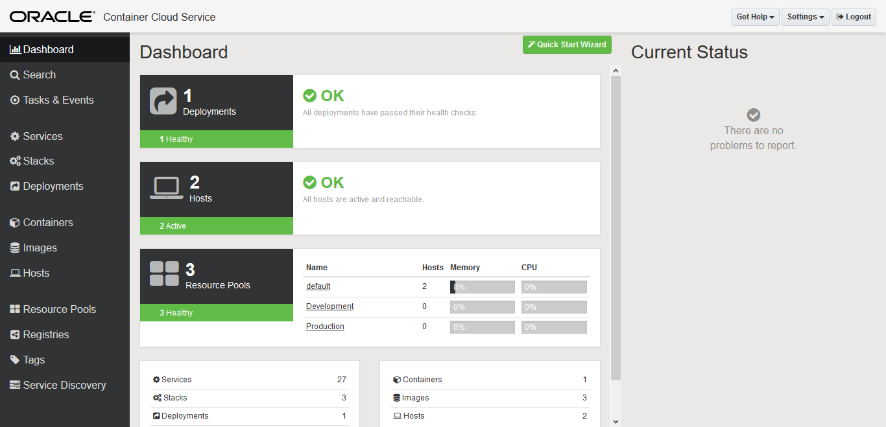

この Container Cloud Service に Docker 環境を作成します。

### Container Cloud の特徴

Oracle Container Cloud Service には、Docker 環境の便利に利用できるように以下のような特徴があります。

- **Docker 互換**
  - Docker Engine や Docker Compose など Docker に互換した機能提供
  - Docker 実行時の命令書式 (Docker Run / YAML) の自動変換
- **Dockdr レジストリ統合**
  - Docker Hub 及び プライベートレジストリへの接続
  - プライベート・コンテナの容易な持ち込み
- **1 クリック・デプロイ**
- **CI/CD 統合**
  - Webhook を用いたイメージの変更時の自動デプロイ
- **ダッシュボード画面**
  - 管理を容易にするダッシュボード画面の提供
- **ヘルスチェック機能**
  - コンテナ・プロセスのヘルスチェック
- **スケーリング**
  - ダッシュボード画面 及び API による容易なスケーリング
- **コンテナの配置ポリシー制御**
  - コンテナの配置をホスト環境のCPU/メモリ、またはタグ情報などによって制御

### Container Cloud Service ターミノロジー

Container Cloud Service を使用する際に、このサービス固有の用語・仕様があるので説明します。

- Service
- Stack
- Deployment

#### Service

**Service** とは、単一の Docker イメージを実行する際に使用する **テンプレート** です。
Docker イメージからコンテナを起動する際には、ポート・マッピングや、ストレージ・ボリュームなど、様々なオプションを指定する事が可能です。しかし、目的や用途、環境などによってい指定するオプションの内容は変わってきます。そこで、この **Service** 定義を用いて、Docker イメージと指定するオプションの組み合わせを予め **テンプレート** として定義しておき、コンテナの起動を容易にするための仕組みです。

#### Stack

**Stack** もテンプレートとして使用する仕組みですが、この Stack によるテンプレートは、**複数コンテナによるテンプレート** です。
つまり、複数の Service を組み合わせて、アプリケーション環境を構成するような用途に用いるテンプレートです。***ELK Stack*** や、***Mean Stack*** のような組み合わせです。

#### Deployment

**Deployment** は、Service や、Stack からデプロイした Docker コンテナのまとまりです。1つのデプロイメントには、1つ以上の Docker コンテナが含まれます。

## 実施手順

Container Cloud Service 上に Docker 環境を作成します。

### 1. Container Cloud Service サービス・インスタンスの作成

Container Cloud Service コンソール画面から **インスタンスの作成** をクリックします。

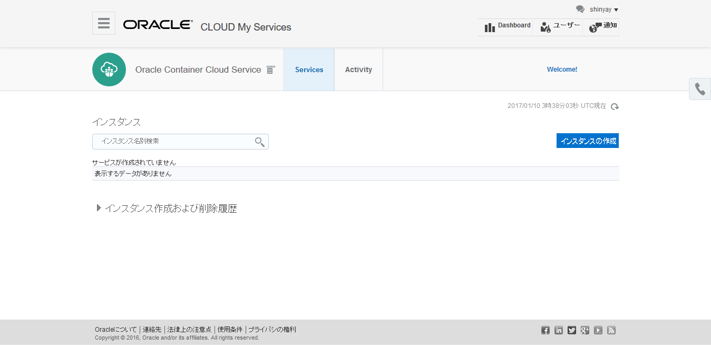

以下の情報を入力します。
- **サービス・インスタンス名**: このサービス・インスタンスに、Docker 環境を作成する
- **サービス・インスタンスの説明**
- **SSH 公開鍵**: サービス・インスタンスをホストする環境にアクセスするために対になる秘密鍵と共に使用

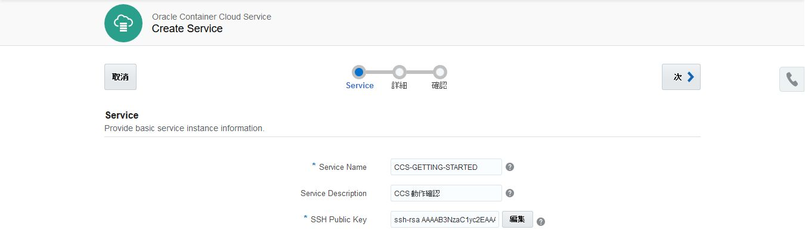

以下の情報を入力します。

- **管理者ユーザ名**
- **管理者パスワード**
- **ワーカーノードのコンピュート・シェイプ**: Docker コンテナが稼働する基盤に割り当てるコンピュータ・リソース
- **ワーカーノード数**: Docker コンテナを稼働するホスト環境のノード数
- **ワーカーノードのデータボリューム**

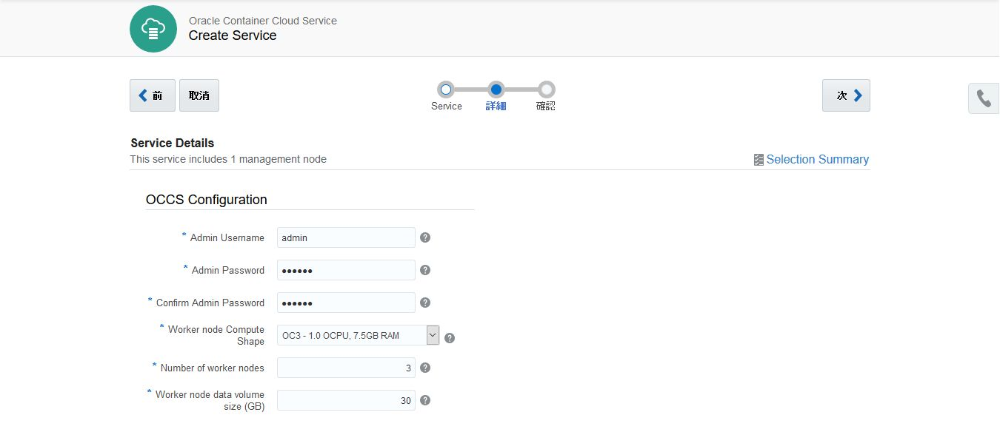

確認画面で修正なければ、**作成** をクリックして、サービス・インスタンスを作成します。

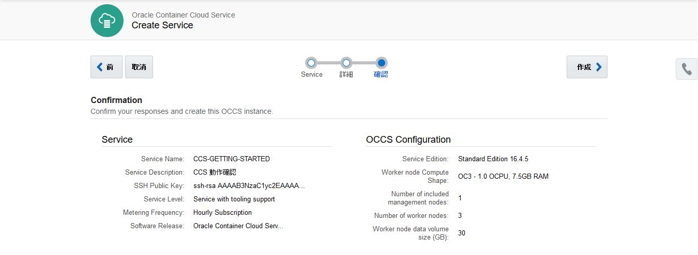

インスタンスの作成を暫く待ち、終了すると次のようにコンソール画面にインスタンス情報が表示されます。

**マネージャーコンポーネント用** のノードとして1つの仮想マシン、**ワーカーコンポーネント用** のノードとして指定した通り3つの仮想マシンが作成されている事が確認できます。

- **マネージャノード** は、各ワーカーノードと通信して Docker コンテナを各ワーカーノードへのデプロイメントのオーケストレーションを行ったり、各コンテナの状況を確認したりといった管理作業を行います。

- **ワーカーノード** は、Docker イメージを保存し、Docker コンテナを稼働させる環境です。

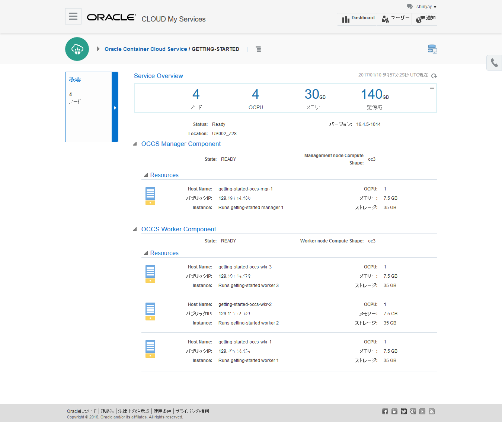

Container Cloud Service サービス・インスタンスのダッシュボード画面に移動します。
コンソール画面上部のインスタンス名の隣にあるハンバーガメニューから **Container Console** を選択します。

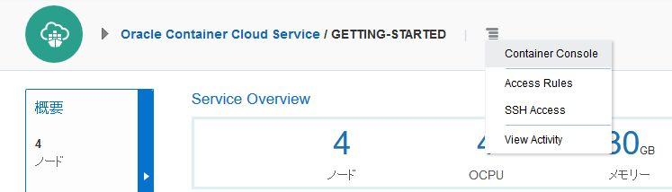

### 2. Container Cloud Service ダッシュボードの利用

Container Cloud Service のダッシュボード画面へのログイン画面が表示されます。ここでは、サービス・インスタンス作成時に設定した **管理者ユーザ名** と、**管理者パスワード**  を入力します。

ログインすると、次のようなダッシュボード画面が表示されます。画面左側にメニューが表示されます。

- **Dashboard**
  - Container Cloud Service インスタンスに関する一覧情報
  - 稼働しているコンテナや、ノードの数やステータス、またシステム・リソース状況について表示
- **Search**
    - Service や、Stack、Docker コンテナ や Docker イメージといった Container Cloud Service のアーティストの検索
- **Tasks & Events**
    - Container Cloud Service 上で実施・発生したイベントに関するログを表示
- **Services**
  - 定義済みの Service の一覧表示
  - Service の新規作成や、定義済みの Service の編集
  - 定義済みの Service のデプロイ (Docker コンテナの起動) / 削除
- **Stacks**
  - 定義済みの Stack の一覧表示
  - Stack の新規作成や、定義済みの Stack の編集
  - 定義済みの Stack のデプロイ / 削除
- **Deployments**
  - デプロイ済みの Service や Stackの一覧表示
  - ライフサイクル管理 (開始 / 停止 / 削除)
- **Containers**
  - 各ホストにデプロイされている Docker コンテナの一覧表示
  - ライフサイクル管理 (開始 / 停止 / 一時停止 / 再開 / 削除)
- **Images**
  - 各ホストに存在する Docker イメージ
  - ライフサイクル管理 (開始 / 停止 / 削除)
- **Hosts**
  - IP アドレスやシステムリソースといったホストに関する情報
  - リソース・プールの移動
- **Resource Pools**
  - リソース・プールとは Docker コンテナをデプロイするホストの論理集合体
  - 定義済みリソース・プールの一覧表示
  - リソース・プールの作成
- **Registries**
  - 使用可能なDocker レジストリ
  - デフォルトではDocker Hub が登録
  - プライベート・レジストリの登録可能
- **Tags**
  - Docker コンテナを分類するために使用するタグ情報
- **Service Discovery**
  - 稼働している Docker コンテナのIPアドレスとポート番号を保持するデータベース

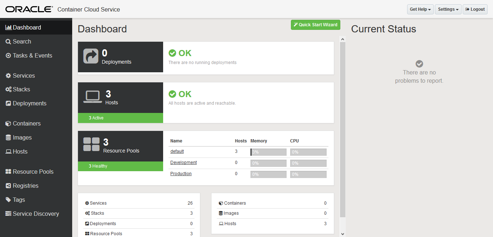

### 3. Docker コンテナの起動

メニューから **Service** を選択して、登録済みのサービス (Docker コンテナ) 一覧を表示します。

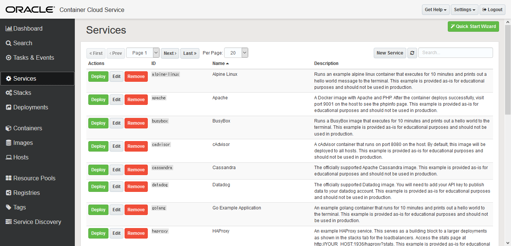

一覧の中から、動作確認用のサンプル・アプリケーション **Hello World Application** (ID: `helloworld`) を選択します。**Deploy** ボタンをクリックします。

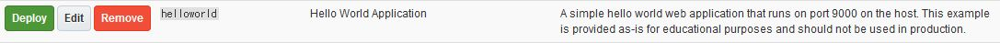

コンテナの配置ポリシーを定義します。**Quantity** を **2** にします。その他はデフォルトの設定にします。
配置ポリシーが、**per-pool (accross hosts in this pool)** になっているので、リソース・プールに指定している ***default*** に関連でけられている ホストに順番に Docker コンテナが デプロイされます。

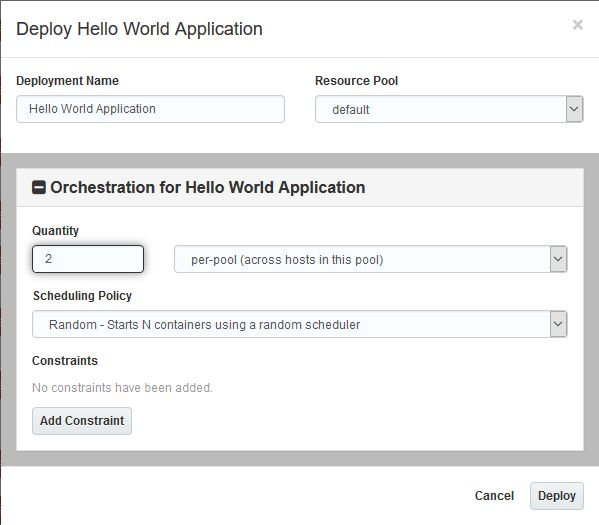

Docker イメージがレジストリからダウンロードされ、起動されるのを待ちます。

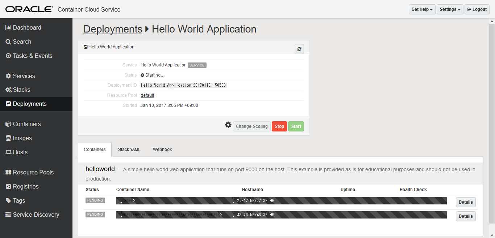

Serice (Docker コンテナ)が起動すると、以下のように各 Docker コンテナのステータスと、名前、デプロイされているホスト名が表示されます。

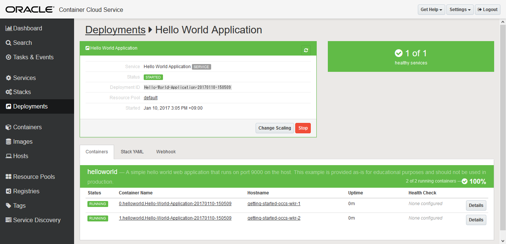

メニューから **Hosts** を選択し、helloworld コンテナが稼働しているホストとのパブリック IP アドレスを確認します。
表示されているIPアドレスをクリックすると仮想ブリッジとパブリック IP アドレスが表示されます。

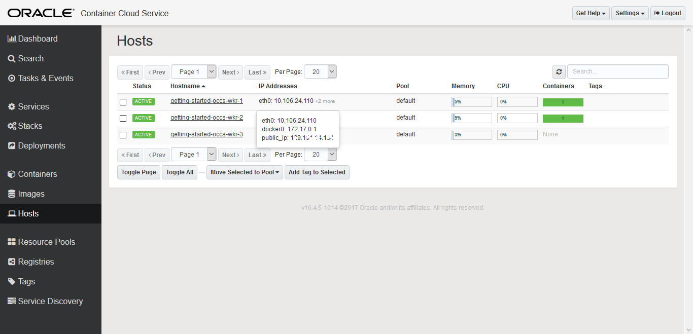

また、**Container** を選択すると、マッピングされているポート番号情報が確認できます。
この helloworld コンテナは、80番ポートを9000番ポートにマッピングしている事が分かります。

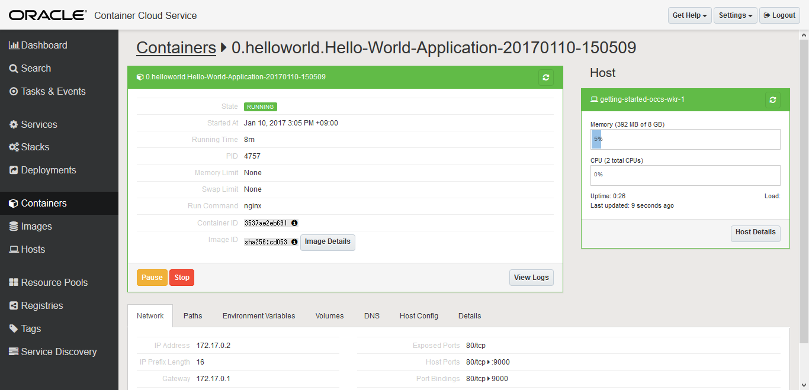

パブリック IP アドレスとポート番号が分かったので、ブラウザからアクセスしてみます。

- http://<パブリック IP アドレス>:9000

Hello と表示され、サンプル・アプリケーションの Docker コンテナが起動している事が確認できました。

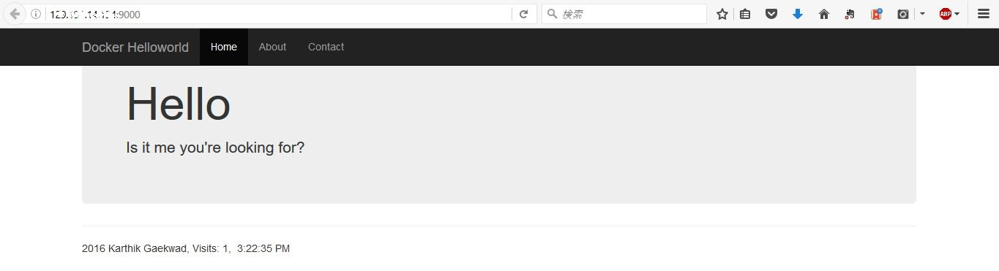

Docker コンテナが起動した状態で、メニューから **Containers** を選択します。
すると、起動時に設定した **Quantity:2** の通り、2つのホストにそぞれぞれ 1つずつ Docker コンテナがデプロイされている事が確認できます。

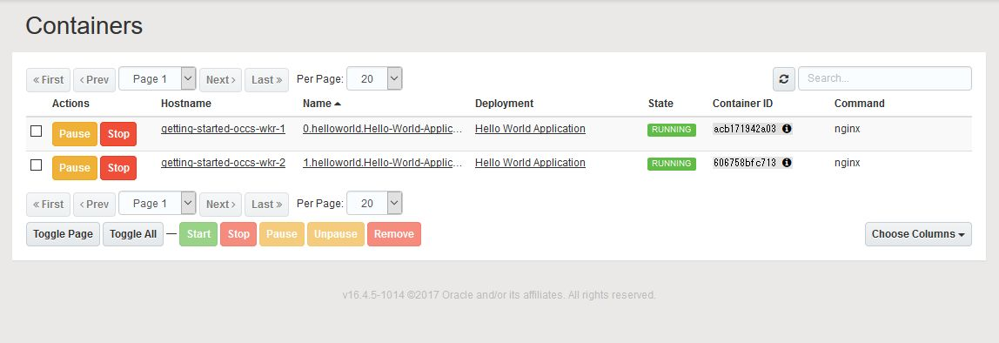

同様に、**Images** を選択すると、各ホストに同じ Docker イメージがダウンロードされている事が確認できます。

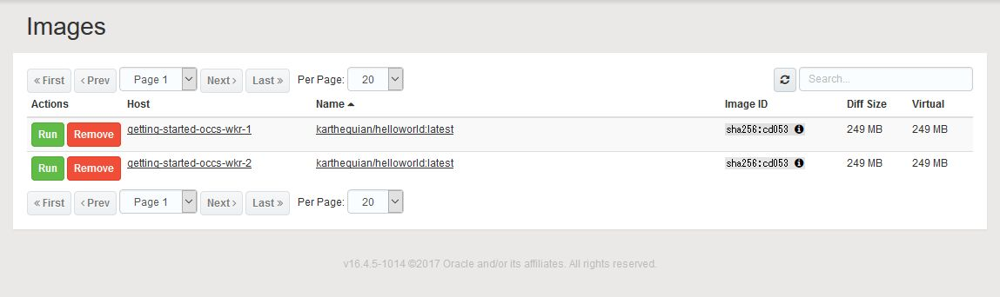

## まとめ

簡単に Docker コンテナを起動し、管理する事を試してみました。Docker コンテナの起動を予め **Service** として定義しておくと作業が簡略化されて操作ミスも少なり便利そうです。
また、ダッシュボード画面での操作が、直感的で Docker の CLI になれていないユーザでも簡単かつ安全に Docker 体験ができそうです。
